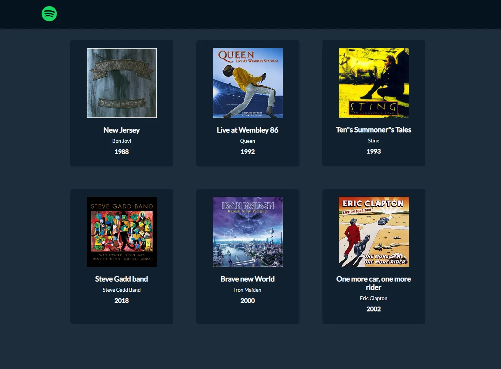

# Descrizione: 
## Creare una web-app che permetta di leggere una lista di dischi presente nel server.
### I dischi dovranno avere questa struttura: titolo, artista, url della cover, anno di pubblicazione, genere

## Consigli:

- #### Nello svolgere l’esercizio seguire un approccio graduale:
- Prima assicurarsi che la pagina index.php riesca a comunicare correttamente con il file server.php
- Solo a questo punto sarà utile passare alla lettura della lista da un file JSON.
## Bonus
- Tramite un form, dare la possibilità all’utente di aggiungere un disco dall’elenco.

> ## Ecco uno screenshot d'esempio di come potrebbe risultare l'applicazione finale
